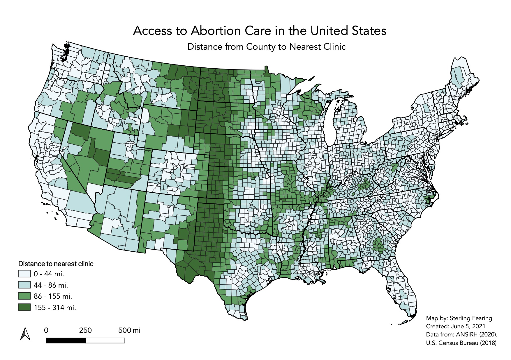
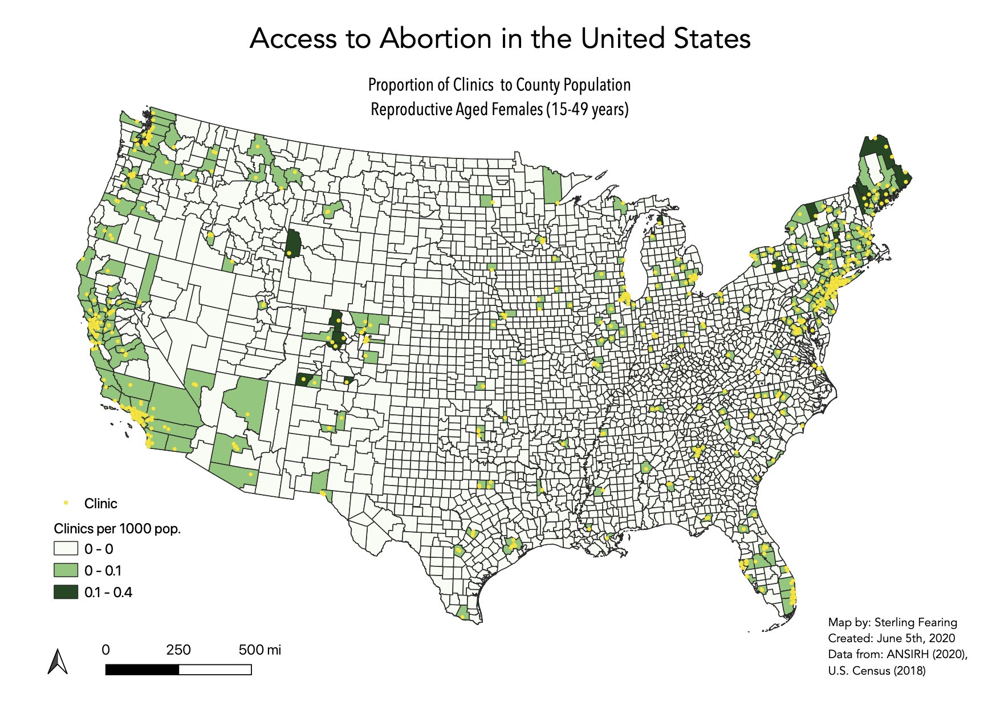

# Access to Abortion Care in the United States

This repository provides a consolidation and analysis of data that is relevant to understanding the accessibility of abortion services in the United States.  

## Introduction
It is estimated that 1-in-4 women in the United States will have an abortion by the age of forty-five. Despite the common and private nature of this procedure, abortion is a topic that has become heavily stigmatized and politicized. Since the legalization of abortion in the 1973 supreme court case *Roe v. Wade*, anti-abortion activists and politicians have worked to enact strict regulations on abortion, with the ultimate goal of overturning the supreme court decision. These restrictions have resulted in disparate access to abortion throughout the country.

Recent events have highlighted the necessity of addressing access to abortion care. Like many issues in the United States health care system, disparities in access to abortion care were exacerbated by the COVID-19 pandemic. As part of the emergency response in March 2020, elective medical procedures were postponed throughout the country. In arguably an opportunistic motion by anti-abortion state officials, abortion was deemed an elective procedure and clinics were shut down in eight states, including: Arkansas, Alabama, Iowa, Ohio, Oklahoma, Tennessee, Texas and West Virginia. In addition, the Trump Administration's election of anti-abortion Supreme Court Justices— Neil Gorsuch, Brett Kavanaugh, and Amy Coney Barrett, presents a significant threat the constitutional right to abortion secured by *Roe vs. Wade*. The anti-abortion stance of the newly appointed Supreme Court Justices could result in overturning the *Roe* decision. 

In light of the shifting power dynamics in the Supreme Court and the abortion restrictions put in place during the COVID-19 pandemic, it is of utmost importance that we turn our attention towards access to abortion care. This repository provides a consolidation and basic analysis of the data that is relevant to understanding access to abortion services in the United States. For more information on the variable constructs selected see [here](https://github.com/sterlingfearing/abortion-access/blob/main/keyFactors.md). 

## Data Overview

### Abortion Clinic Locations
The location of abortion clinics used for this analysis are sourced from the program for Advancing New Standards In Reproductive Health (ANSIRH) at the University of California San Francisco. The 2020 database, includes information on 1,068 facilities publicly known to provide abortion in the United States. The ANSIRH data base includes only facilities that publicly advertise providing abortion care. As such, this database is representative of the locations where most people would go to seek an abortion. It is a comprehensive list of specialized and non-specialized clinics, which account for 95% of abortions provided in the United States.

Access to this database can be requested [here](http://abortionfacilitydatabase.org).

### Geographic Boundaries
| Variable Construct | Variable Proxy | Source | Spatial Scale |
| :----------------- | :------------- | :----- | :------------ | 
| Geographic Boundaries | State, County, Census Tract | US Census, 2018 | State, County, Tract |

### Demographic Variables
| Variable Construct | Variable Proxy | Source | Spatial Scale |
| :----------------- | :------------- | :----- | :------------ | 
| Population age 15-49| Total female population of reproductive age | ACS 2014-2018 | County |
| Race & Ethnicity | Percentages of population defined by categories of race and ethnicity | ACS 2014-2018 | County |

### Economic Variables
| Variable Construct | Variable Proxy | Source | Spatial Scale |
| :----------------- | :------------- | :----- | :------------ | 
| Poverty | Percent of population living below the Federal Poverty Line | ACS 2014-2018 | County |
| Per Capita Income | Per capita income in the past 12 months | ACS 2014-2018 | County |

### Policy Variables
| Variable Construct | Variable Proxy | Source | Spatial Scale |
| :----------------- | :------------- | :----- | :------------ | 
| Legislative Control | Majority political party representation in the House and Senate | NCSL 2021 | State |
| Governor | Governor's political party affiliation | NCSL 2021 | State |
| State Control | Legislative control and governor's party affiliation  | NCSL 2021 | State |
| 2nd Physician Required | Time period after which a second physician must participate | Guttmacher 2021 | State |
| Gestational Limit | Time period after which abortion is prohibited except in the cases of life or health endangerment | Guttmacher 2021 | State |
| "Partial Birth" Abortion Banned | Definition of "partial birth" abortion varies but typically applies to method of dialation and extraction | Guttmacher 2021 | State |
| Public Funding Available | State funds available for all or most medically necessary abortions | Guttmacher 2021 | State |
| Public Funding Limited | State funds limited to cases of life endangerment, rape, and incest | Guttmacher 2021 | State |
| Private Insurance Coverage Limited | State limits private insurance companies from offering coverage for abortion | Guttmacher 2021 | State |
| Parental Involvement | State requirement of parental notification and/or consent for minors | Guttmacher 2021 | State |
| Counseling | In-person counseling necessitates two trips to the clinic | Guttmacher 2021 | State |

### Physical Environment Variables
| Variable Construct | Variable Proxy | Source | Spatial Scale |
| :----------------- | :------------- | :----- | :------------ | 
| Urban/Rural Classification | Classification of areas as rural, urban or suburban using percent rurality (County) or RUCA Codes (Tract) | Kolak et al, 2021; USDA & ACS, 2014-2018 | County, Tract |

### Access Variables
| Variable Construct | Variable Proxy | Source | Spatial Scale |
| :----------------- | :------------- | :----- | :------------ | 
| Access to Clinics | Distance to nearest clinic | ANSIRH 2020; Kolak et. al 2020 | County, Tract |

## Methods Used
The data used to generate the maps below can be found in the data folder of this repository. The scripts used to source and clean the data is available in the code folder. The final visualizations shown in the images below were created in QGIS. 

## Results

The map below shows the distance from the center of each county to the nearest abortion clinic. The steps to generate a nearest resource analysis using the data provided can be found [here](https://geodacenter.github.io/opioid-environment-toolkit/centroid-access-tutorial.html). 

The following map shows the number of clinics in each county per 1,000 women of reproductive age (15-49). 

## Discussion

Both of the maps above seem to demonstrate greater geographic barriers to access in the mid-western region of the United States. This is particularly noticable when looking at the first map which demonstrates the distance from the center of each county to the nearest abortion clinic. The second map indicates that access to abortion clinics per capita seems to be better along the coastal regions of the United States, particularly in California and New York. 

## Conclusion

The goal of this report was to provide the data and documentation necessary to support further analysis of access to abortion in the United States. The exploratory data analysis shown in the maps above scratch the surface of the potential for identifying the populations in the United States that face the greatest barriers to accessing abortion care. I look forward to continuing this analysis in my future research for my MA thesis. 

