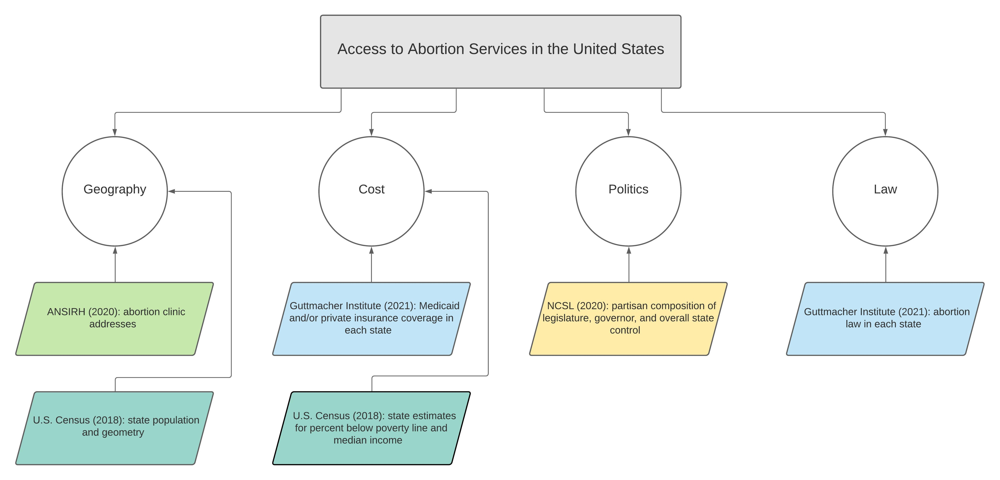

```{r setup, include=FALSE}
knitr::opts_chunk$set(echo = TRUE)
```

This report aims to provide a comprehensive understanding of access to abortion care in the United States by analyzing variables identified in existing research as key determinants of access. The factors identified include: politics, law, cost, and geography.





### Politics

Arguably the most influential factor producing geographic disparities in access to abortion care in the United States is the absorption of the topic by the political sphere. The divide between the Republican party's "pro-life" stance and Democratic party's "pro-choice" approach has been normalized and widely accepted. However, it is important to note that abortion only became a bipartisan political issue in 1972, when Nixon’s presidential campaign took a strong anti-abortion position in an attempt to garner votes from Catholics and social conservatives (Greenhouse, 2011). As a result of this party alignment, political representation in state government among Republicans and Democrats is consistently a determining factor in state-level abortion policies. The politicization of abortion has created an environment where abortion is singled out in government health care policies. For example, in 2010 the political divide surrounding abortion nearly derailed the passage of the Affordable Care Act (ACA). Despite abortion being one of the most common surgical procedures in the United States, funding for abortion was removed in order for the ACA to be put in place (McFarlane, 2021). Existing research consistently shows that the political party affiliation of state representatives is a driving factor in state-level abortion policies that affect access to care.

To include the partisan composition of state leadership as a factor in access to abortion care, this report includes data from the *National Conference of State Legislatures (2021)*. This source outlines the party affiliation of the governor and House/Senate representatives in each state to classify legislative control, governor party and state control. Chamber control is defined as the majority political party in either the House or Senate. Legislative control delineates the partisan majority in the House and Senate. When the same party controls both the House and the Senate, legislative control is either Republican or Democrat. If different parties control the chambers, legislative control is considered to be divided. State control extends this classification to the governorship. If the political affiliation of the governor and the majority in each chamber are the same, state control is either Republican or Democrat. If not, state control is divided. Nebraska is the only state excluded from this classification because it operates on a unicameral, nonpartisan system. Therefore, Nebraska is recorded as nonpartisan. In outlining the partisan composition of representatives in each state, this data provides a necessary foundation to understanding the correlation between politics and access to abortion. 

### Law
Since the legalization of abortion in 1973, anti-abortion officials and advocates have worked to implement countless regulations on the procedure. In 2011 alone, there were 62 new restrictions placed on abortion throughout 21 of the U.S. states. These restrictions included measures such as: in-person visits, 24-72 hour waiting periods after the initial appointment, regulation of gestational limits, and hospital admitting privileges for clinics (Jones 2011). The legal regulation of abortion care is often identified as the Targeted Restriction of Abortion Providers, or TRAP laws. Researchers have criticized TRAP laws, stating that they do not serve the intended purpose of protecting women’s health, but rather work to deter women from seeking care and make abortion clinics too expensive to operate (Greenhouse, 2021; Jones, 2011; Lichter 1998; Bearak, 2017). Abortion restrictions vary greatly between states and depend heavily on the political and social climate surrounding the issue. Unfortunately, unintended pregnancy is not isolated to states with liberal abortion policies and these restrictions result in disparate access to care throughout the county.

The Guttmacher Institute provides regularly updated documentation of abortion laws. To analyze the restrictiveness of abortion policy in each state as of 2021, I focused on several key regulations from the Guttmacher Institute's data set, including: the requirement of a licensed physician for non-surgical and/or surgical abortions, gestational limits on abortion, partial birth abortion bans, Medicaid coverage, state-wide bans on private insurance coverage, waiting periods, and the requirement of parental notification/consent for minors. 

### Cost
The cost of abortion care as a measure of access highlights key socioeconomic factors that are important determinants in access to abortion care. A research study comparing access to abortion in the U.S. to Western European countries found that lack of public funding for abortion services in the U.S. was the most effective deterrent for women accessing abortion care (McFarlane, 2021). Despite abortion being one of the most common surgical procedures in the United States, there are 24 states that ban private health insurance plans from offering coverage for abortion, and there are only 17 states that offer funding through Medicaid (McFarlane, 2021). Lack of funding for abortion care creates a significant barrier to access. Women who cannot cover the cost of the procedure might delay until they have saved up the funds. However, as time goes on the cost increases from $400-$550 within 12 weeks of pregnancy to $1100-$1650 between 20-21 weeks (McFarlane, 2021). If a woman cannot gather the funds necessary for the procedure before reaching the gestational limit in their state, they will either have to collect more money to travel out of state or be forced to carry the unintended pregnancy to term. The significance of economic barriers to access are heightened by the consequences of being denied care. Previous research shows that among women seeking abortion, those who were denied care due to were four times more likely to end up living below the Federal Poverty Level (FPL)(Foster, 2020). The life-altering effects of unintended pregnancy and the time sensitive nature of the procedure underscore the importance of accessibility. 

To understand which areas of the United States are most vulnerable to cost as a barrier to accessing abortion care, I include data from the U.S. Census on the percent of the population living below the FPL and the median income in each state, as well as, the regulations on public and private funding outlined in the previous section. 

### Geography
Despite the recognition of abortion as constitutional right, access to abortion is highly dependent on geographic location. As of 2021, there are six states that have only one abortion clinic, while states such as New York and California have 95 and 160 clinics respectively. Previous studies have shown a negative correlation between the distance a woman lives from an abortion clinic and the likelihood of having an abortion (Bearak, 2017). As a result of most clinics being concentrated in urban areas where a higher percentage of the population resides, most women do not need to travel long distances to reach an abortion clinic. However, there is a large minority of women who live beyond 90 miles of the nearest clinic (Bearak, 2017). This research posits that clinic closures are especially devastating for women living in rural areas that already have considerable distances to travel. For women in regions of the United States that do not have an abortion clinic within close proximity, traveling long distances can make abortion care inaccessible. This barrier places a disproportionate burden on women who do not have the financial resources to travel, take leave from work, and arrange childcare for existing children, in addition to the cost of the procedure. 

To better understand geographic access to abortion, this analysis sources addresses for abortion clinics in the United States from the program for Advancing New Standards In Reproductive Health (ANSIRH) at the University of California San Francisco. The 2020 database, includes information on 1,068 facilities publicly known to provide abortion in the United States. The ANSIRH data base includes only facilities that publicly advertise providing abortion care. As such, this database is representative of the locations where most people would go to seek an abortion. It is a comprehensive list of specialized and non-specialized clinics, which account for 95% of abortions provided in the United States. 

### Sources: 

Medoff, H. "The Determinants and Impact of State Abortion Restrictions." The American Journal of Economics and Sociology 61, no. 2 (2002): 481-93. Accessed January 29, 2021. http:// www.jstor.org/stable/3487791. 

Jones, Rachel K., Mia R. S. Zolna, Stanley K. Henshaw, and Lawrence B. Finer. "Abortion in the United States: Incidence and Access to Services, 2005." Perspectives on Sexual and Reproductive Health 40, no. 1 (2008): 6-16. Accessed January 29, 2021. http://www.jstor.org/ stable/30042994. 

Jones, Rachel K., and Jenna Jerman. "Abortion Incidence and Service Availability In the United States, 2011." Perspectives on Sexual and Reproductive Health 46, no. 1 (2014): 3-14. Accessed January 29, 2021. doi:10.2307/48576342. 

GREENHOUSE, LINDA, and REVA B. SIEGEL. "Before (and After) Roe v. Wade: New Questions About Backlash." The Yale Law Journal 120, no. 8 (2011): 2028-087. Accessed January 29, 2021. http://www.jstor.org/stable/41149586. 

ERDMAN, JOANNA N. "Theorizing Time in Abortion Law and Human Rights." Health and Human Rights 19, no. 1 (2017): 29-40. Accessed January 29, 2021. http://www.jstor.org/stable/ 90007913. 

McFarlane, Deborah R. "The Affordable Care Act and Abortion: Comparing the U.S. and Western Europe." Politics and the Life Sciences 34, no. 2 (2015): 52-70. Accessed January 29, 2021. https://www.jstor.org/stable/26372759. 

GREENHOUSE, LINDA, and REVA B. SIEGEL. ""Casey" and the Clinic Closings: When "Protecting Health" Obstructs Choice." The Yale Law Journal 125, no. 5 (2016): 1428-480. Accessed January 29, 2021. http://www.jstor.org/stable/43894435. 

Lichter, Daniel T., Diane K. McLaughlin, and David C. Ribar. "State Abortion Policy, Geographic Access to Abortion Providers and Changing Family Formation." Family Planning Perspectives 30, no. 6 (1998): 281-87. Accessed January 29, 2021. doi:10.2307/2991504. 

Calkin, S. (2019). Towards a political geography of abortion. Political Geography, 69, 22–29. https://doi.org/10.1016/j.polgeo.2018.11.006 

Bearak, J. M., Burke, K. L., & Jones, R. K. (2017). Disparities and change over time in distance women would need to travel to have an abortion in the USA: a spatial analysis. The Lancet Public Health, 2(11), e493–e500. https://doi.org/10.1016/s2468-2667(17)30158-5 


